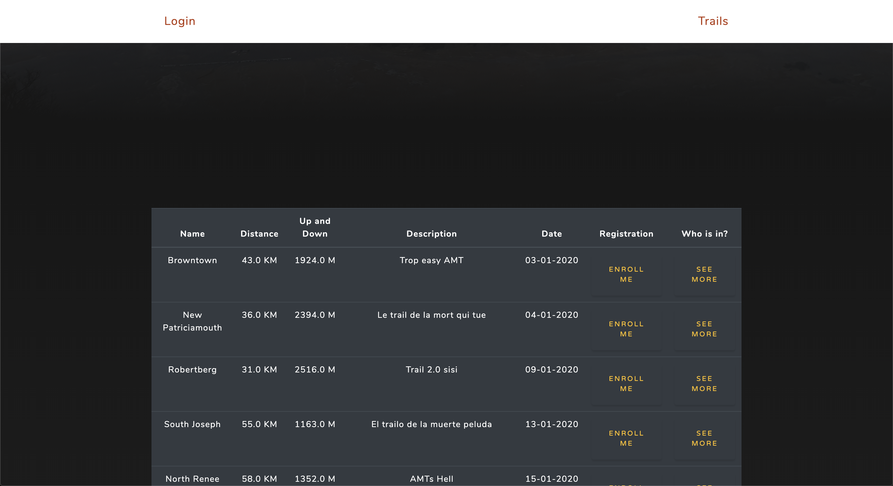
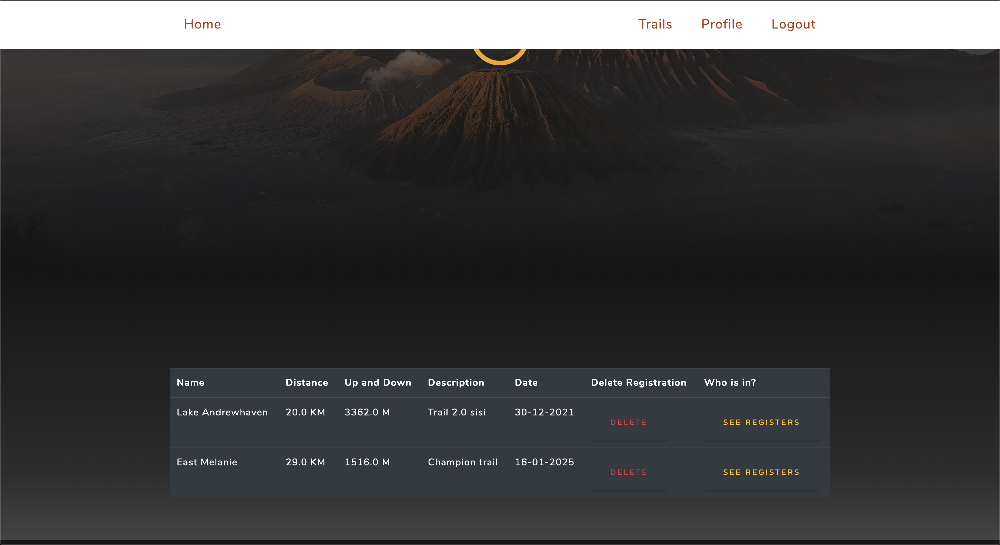
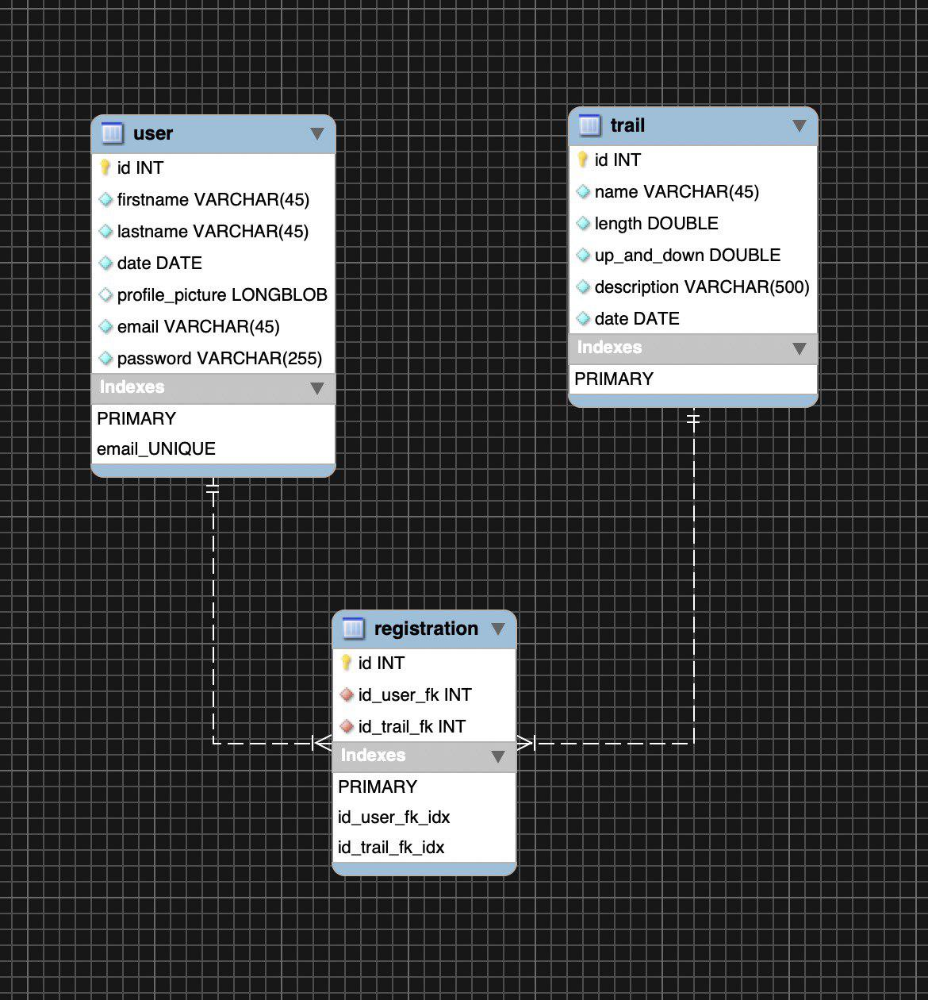

# Rapport : Projet N°1 - Site de Randonnée

### Description globale

Nous avons créer un site permettant à des utilisateurs de créer des sessions de randonnée et de pouvoir s'y inscrire. Le client arrive sur une première page qui lui montre les différentes randonnées auxquelles il pourra s'inscrire s'il crée un compte. Après s'être inscrit au site puis s'être connecté, l'utilisateur peut en plus de voir les différentes randonnées, s'inscrire à ces dernières et voir quels autres utilisateurs y sont déjà inscrit. Il a aussi la possibilité de changer ses informations grâce à une page de profil. La page home lui permet de voir à quelle randonnée(s) il s'est inscrit et bien évidemment de pouvoir se désinscrire. Finalement, il peut se délogger de l'application.

  

Première page sur laquelle on arrive

Page home (affichant les randonnées auxquelles l'utilisateur est inscrit)

Page de modification de profil

### Description fonctionnelle

#### Page Trail (avant connexion) :

C'est la première page sur laquelle l'utilisateur arrive, il peut y voir toutes les randonnées proposé. S'il veut voir qui est déjà inscrit ou s'inscrire au trail, on est renvoyé vers la page de login.

#### Page Login :

Cette page permet à l'utilisateur de se connecter s'il possède un compte ou de s'enregistrer.

#### Page Register :

Cette page permet à l'utilisateur de s'enregistrer en fournissant son email (unique), son nom, son prénom, son password, une confirmation de ce dernier et une date de naissance.

#### Page Trail (après connexion) :

Cette page permet de créer une nouvelle randonnée en fournissant un nom, une distance, une dénivellation, une description et une date. L'utilisateur peut aussi voir la liste des randonnées, auxquelles on peut s'inscrire ou voir qui y est déjà inscrit.

#### Page Home :

Cette page montre les différentes randonnées auxquelles l'utilisateur s'est inscrit et lui permet de de désinscrire. Il peut aussi cliquer sur un lien lui permettant de voir qui est déjà inscrit à la randonnée.

#### Page Profil :

Cette page permet à l'utilisateur de modifier ces informations personnelles (sauf l'email qui sert d'identifiant). 

#### Page Data :

Cette page permet, après avoir cliqué sur le lien "see registers", d'afficher la liste des participants. L'utilisateur peut ensuite cliquer sur "see more" pour afficher les informations d'un participant en particulier.

### Description des entités

Pour gérer notre application, nous avons trois entités différentes. La première est l'entité **user**, l'entité **trail** et l'entité **registration**.

#### User :

L'entité user représente un utilisateur caractérisé par un ID unique généré automatiquement par la base de données. Des informations personnelles tel que le nom, le prénom, la date de naissance et une photo de profil. L’émail est aussi unique et sert d'identifiant pour l'utilisateur. Il possède finalement un mot de passe pour pouvoir s'authentifier.

#### Trail :

L'entité trail représente une randonnées, elle possède elle aussi un ID unique généré automatiquement par la base de données. Elle possède ensuite toutes les informations nécessaire à sa définition tel que son nom, sa distance, sa dénivellation, sa description et sa date.

#### Registration :

L'entité registration est le lien entre nos deux première entités. Elle est composé d'un  ID unique généré automatiquement par la base de données, de l'ID d'un utilisateur et de l'ID du trail auquel ce dernier souhaite s'inscrire.

### Implémentation

Notre application comporte trois grandes parties. Une partie **model** qui comporte les classes représentant nos différentes entités. Une partie **integration** qui comporte nos différentes DAO et donc les interactions avec la base de données. Une partie **presentation**  qui comporte nos différents servlets qui ont le rôle de contrôleur. Ils vont dispatcher le user sur les différents JSP et vont appliquer le filtre pour vérifier les autorisations et l'authentification. 

Nous avons aussi deux autres plus petites parties. Une partie **business** qui comporte des classes nous permettant de faire différentes vérifications et d'informer l'utilisateur lorsque cela est opportun. Une partie **utils** qui comporte nos utilitaires tel que la création de la pagination, la classe gérant les dates ou encore le hashage des mots de passes.

Nous avons utilisé un bootstrap (Grayscale) pour enjoliver le rendu de notre application.

Nous avons dû au fur est à mesure du projet élaguer ce dernier pour rendre une application fonctionnel à la fin du temps imparti. Nous avons notamment supprimer la partie résultats de notre application. Nous voulions, dans le cadre de randonnées sportive, qu'un admin puisse rentré les résultats des courses et avoir un affichage de ces derniers. Cela nous demandait trop de temps, nous l'avons donc simplement supprimé. Nous voulions aussi que l'utilisateur possède une photo de profil. 

À l'heure actuelle, il est possible d'upload une photo (stocké au format binaire dans la base de données) mais nous n'avons pas eu le temps d'afficher cette dernière sur notre application. Nous avons décider de laisser cela en l'état pour une possible amélioration future.

Nous avons aussi décidé que le prénom, le nom, la date de naissance et la photo d'une personne étaient des données publiques qui permettaient aux utilisateurs de ce faire une idée des personnes avec qui ils allaient partager la randonnée. Et que d'autres informations comme l'email ou le password devaient rester privé.

### Bugs & Limitations

#### Bugs

Au niveau des bugs, le seul bug que nous avons constaté est que dans certains cas, si la base de données n'est pas "UP", il peut y avoir un NullPointerException dans la page de Trail. Si ce cas devait arriver, il faut recharger la page après avoir relancer la base de données.

#### Limitations

Le projet a été réduit au strict minimum comme expliqué dans la partie implémentation. 

L'affichage de la photo à été stoppé.

