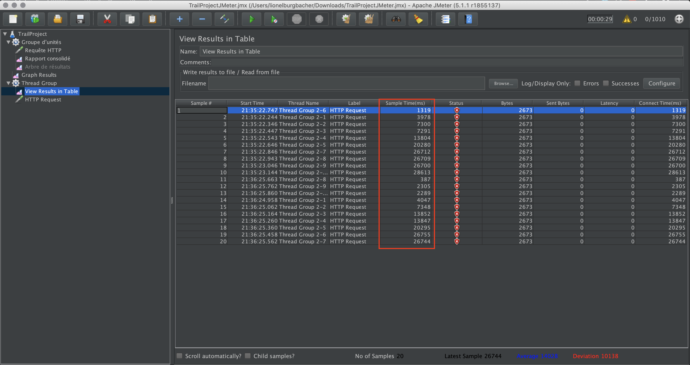
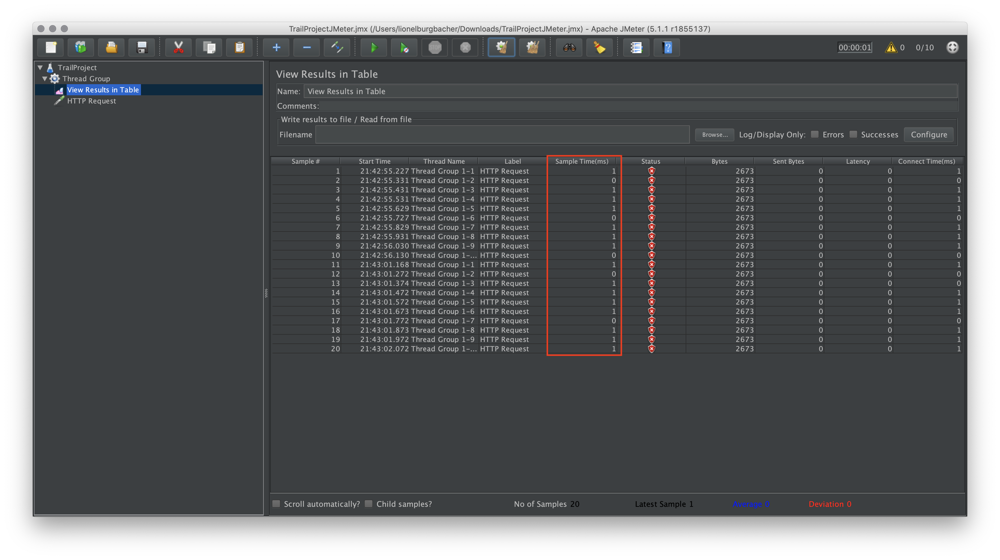

# Stratégie de test

Pour lancer les tests JUnit, Mockito & Arquillian, il vous faut vous placer dans la racine du projet et de lancer la commande suivante : `mvn clean test` après avoir build la topologie dockerTest.

## Test JUnit

Nous avons testé nos classes model et nos classes utilitaires à l'aide de tests unitaires JUnit. Les tests unitaires nous permettent de vérifier localement que l'implémentation de nos différentes méthodes sont correctes et ne comportent pas d'effet de bord. Tous les effets de bord possible ne sont clairement pas tous testé dans nos tests, cela demanderait à lui seul beaucoup trop de temps. Nous nous sommes donc concentré sur les points que nous trouvions les plus importants (tester le hashage des mots de passes ou les tests concernant la pagination).

## Test Mockito

Pour tester nos servlets, nous avons utilisé le framework Mockito.  Nous avons donc testé la classe login à l'aide de ce dernier. Si le temps nous l'avait permis, il aurait été intéressant de pouvoir tester tous nos servlets pour vérifier qu'aucun problème ne se soit glisser dans notre implémentation.

Mockito est très intéressant pour automatiser nos tests en créant de "faux objets" que nous pouvons utiliser dans nos servlets. Il demande cependant énormément de code (Exemple : il faut créer des mocks de tous les objets qui seront appelé dans la méthode que nous voulons tester sous peine de recevoir un NullPointerException).

## Test Arquillian

Avec les tests Arquillian nous allons pouvoir tester les différentes DAO de notre projet. Nous avons testé toutes les méthodes des différentes DAO. La première fois que nous l'avons effectué, nous avons pu remarquer que renvoyer les ID des différents objets lors de leur ajout dans la BD était indispensable. Nous avons donc réimplémenter certaines méthodes pour qu'elles le retourne. Nous avons fait en sorte que chacun des tests soit autonome (qu'il ne dépende d'aucun autre test).

## Test JMeter

Pour la partie Jmeter, nous avonc donc tester le temps de réponse quand il y a ou non la pagination sur la page de garde (trail). La partie bonne pagination correspond donc à une pagination qui utilise LIMIT dans une requête SQL et donc ne charge que la nombre de trail affiché sur la page tandis que la mauvaise pagnination n'utilise pas LIMIT et donc charge tous les trails mais n'affiche qu'une partie de ceux-ci.

Dans notre test, nous avons testé la différence de temps de réponse entre les deux types de pagination. Il faudrait encore prendre en compte le temps de latence mais vu qu'il s'agit d'un test en local, il n'a aucune influence.

Le Sample Time correspond au temps (milisecondes) que le serveur met pour répondre totalement à la requête.

Mauvaise Pagination : Temps dans le rectange rouge

Bonne pagination : Temps dans le rectangle rouge

On constate une différence significative entre les deux types de pagination. Il faut donc bien appliqué une pagination avec une requête SQL contenant LIMIT.

## Efficacité de nos tests

Nous pensons qu'à l'heure actuelle nos différents tests montrent que nous avons compris dans les grandes lignes à quoi servaient les différents framework ou plateforme de test que nous avons utilisés. Il ne garantissent cependant pas une couverture complète de notre application. Cela demanderait beaucoup plus de temps et d'aller beaucoup plus loin dans les réflexions concernant notre stratégie de tests. Ils nous ont cependant permis de "mettre les mains dans le cambouis" et de nous rendre compte de certaines choses comme  l'importance  de la pagination ou de renvoyer un ID lors de l'ajout d'un objet dans la base de données